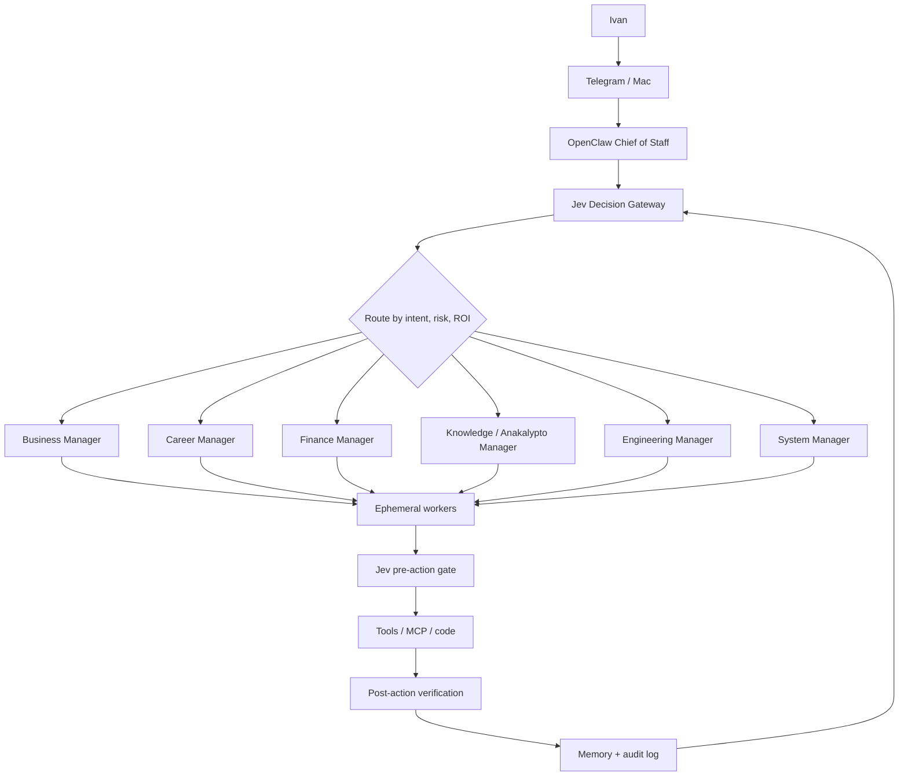

# Architecture v1

## System topology



## Decision cascade
Use the cheapest reliable mechanism first:
1. Deterministic code.
2. Jev.
3. Local model.
4. Premium model.
5. Human for irreversible or identity-bearing actions.

## Context architecture
```
all available context
        ↓
metadata / deterministic filtering
        ↓
semantic retrieval
        ↓
Jev relevance selection
        ↓
small evidence bundle
        ↓
Claude / Codex / worker
```

Goal: **maximum relevant context per token**.

## Claude Code ↔ Codex
They are peers, not duplicate writers.
- one acts as primary builder;
- the other independently reviews;
- Jev classifies findings by severity/confidence;
- disagreement triggers a focused second pass;
- historical performance informs future routing.

## Deployment split

### VPS — always-on control plane
OpenClaw, Jev Gateway, PostgreSQL + pgvector, Redis/queue, schedulers, policy/memory services and audit logs.

### MacBook — workstation
Claude Code, Codex, Cursor, Obsidian, MLX/Ollama and interactive development.

Connect both through a private encrypted network.
