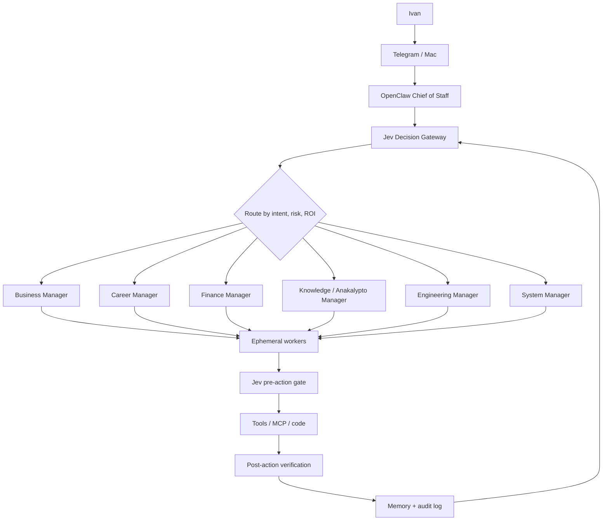

# Architecture v1

## System topology



## Decision cascade
Use the cheapest reliable mechanism first:
1. Deterministic code.
2. Jev.
3. Local model.
4. Premium model.
5. Human for irreversible or identity-bearing actions.

## Context architecture
```
all available context
        ↓
metadata / deterministic filtering
        ↓
semantic retrieval
        ↓
Jev relevance selection
        ↓
small evidence bundle
        ↓
Claude / Codex / worker
```

Goal: **maximum relevant context per token**.

## Claude Code ↔ Codex
They are peers, not duplicate writers.
- one acts as primary builder;
- the other independently reviews;
- Jev classifies findings by severity/confidence;
- disagreement triggers a focused second pass;
- historical performance informs future routing.

## Deployment phases

### Current pilot — Mac only
For the first months, Ivan runs the system locally with ChatGPT, Cowork, Codex, Claude, OpenClaw and Obsidian. Existing Jev services on the Mac remain available for useful classification/review, not as a mandatory step for every task. The Mac must be on for its background services and local vault access. Prioritize measured, complete workflows before adding infrastructure. No VPS purchase or deployment is authorized by this plan.

### Possible later phase — always-on VPS
If observed workflows need to run while the Mac is off, propose a separately approved VPS deployment for OpenClaw, appropriate gateway, scheduler, private policy/memory services and audit logs. PostgreSQL + pgvector and Redis/queue are optional until justified by measured requirements. Keep interactive development, local Obsidian use and possible MLX/Ollama inference on the Mac. Define private connectivity and vault synchronization before any migration.
